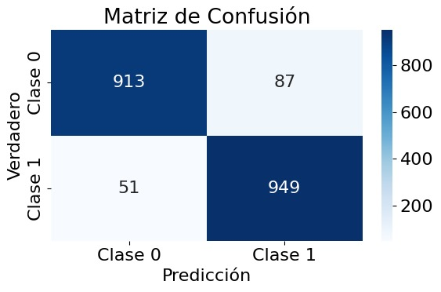
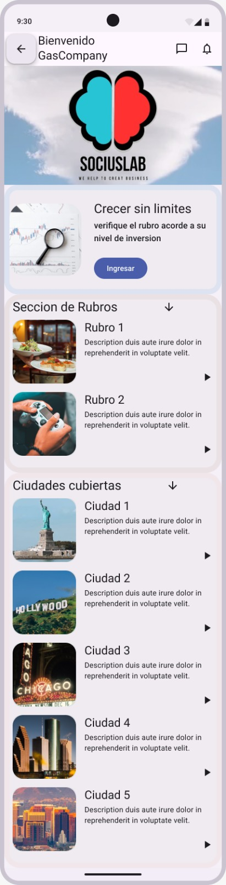
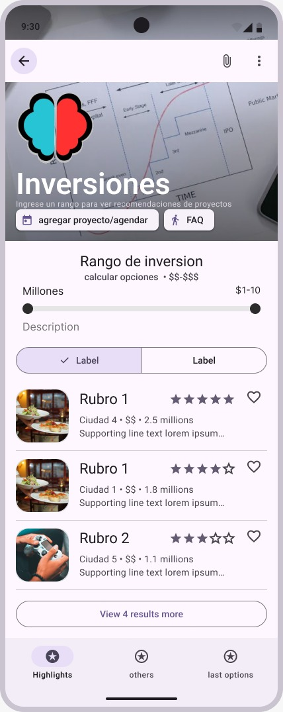

# Consultora Socius Lab

.png)

# Alcance del proyecto
Las tareas que se realizarán en este proyecto están documentadas en el tablero de actividades de Trello, algunas de estas son:

* Formulación de minimo 3 KPI's.
* Análisis preliminar de los datos.
* Análisis EDA.
* ETL Completo.
* Pipeline del ETL.
* Diseño del modelo Entidad Relación.
* Dashboard.
* Modelo de ML.

El objetivo final de este proyecto es desarrollar un MVP (Producto Mínimo Viable) que recomiende al usuario en qué lugar de una ciudad invertir para crear un negocio en un rubro específico que él mismo seleccione. Este MVP consistirá en un dashboard que mostrará insights obtenidos a partir de los datos recopilados de Google Maps y Yelp. Además, se integrará un modelo de Machine Learning (ML), el cual proporcionará las mejores recomendaciones al usuario.

Dado que este proyecto es un MVP, se utilizarán solo algunos datos. Específicamente, se trabajará con datos de una sola ciudad y se considerarán únicamente dos sectores.

# Equipo de trabajo - Roles y responsabilidades
* <a href = "https://github.com/DomiAndi"> Leslie Andrea </a> - Data Analyst
* <a href = "https://github.com/matiasbarriosled"> Matias Barrios </a> - Data Engineer
* <a href = "https://github.com/moralespbl"> Pablo Morales </a> - ML Engineer
* <a href = "https://github.com/AgustinNiederle"> Agustin Niederle </a> - Data Scientist
* <a href = "https://github.com/FJRB10"> Francisco Ramirez </a> - Analista Funcional

# Metodología de trabajo
La metodología de trabajo que se decidió utilizar está basada en Scrum, ya que todo el equipo tiene una reunión diaria. Sin embargo, esta reunión excede el tiempo estipulado por Scrum para una daily; en este caso, la reunión diaria dura entre 45 y 60 minutos. En esta reunión se expone el avance logrado, los problemas encontrados, cómo se resolvieron o si aún no se ha encontrado una solución, y finalmente, se discute con qué se continuará.

Las tareas que se deben realizar por cada sptint se ingresan en la aplicación Trello y se asigna a la persona o personas encargadas de dicha tarea. La tarea solo puede tener 3 estados dentro de la aplicación de Trello y son:

* Por hacer (To Do)
* Haciendo (Doing)
* Hecho (Done)

Además para saber cuanto es la duración aproximada de cada tarea se realizo un diagrama de Gannt en la aplocación Gantter de Google y la aplicación Trello también nos permite visualizar un diagrama de Gannt de acuerdo a la duración de las actividades.

# Cronograma general - GANNT
<table>
    <tr>
        <td>  </td>
        <td>  </td>
    </tr>
    <tr style="text-align: center;">
        <td> <a href = "https://trello.com/b/dt6k7HK2/proyectofinal"> Tablero de actividades </a> </td>
        <td> <a href = "https://google.gantter.com/gantterforgoogleapps/index.html?fileID=19jRy4hklzPthEojqQ-HWhzz0Tj3s3t6I#amode=normal&fileID=19jRy4hklzPthEojqQ-HWhzz0Tj3s3t6I"> Diagrama de Gantt </a> </td>
    </tr>
</table>

# Análisis preliminar de los datos
## Datasets de Google Maps
## Metadata de sitios
Las siguientes observaciones son de los datos sin hacer ninguna modificación o alteración.

1. **Valores Nulos y Vacíos**:
   - Varias columnas, como `description`, `price`, y `hours`, presentan un alto número de valores nulos. En particular, la columna `description` tiene un 91.59% de valores nulos, lo que indica que la mayoría de las entradas no tienen descripción. En concecuencia estos datos habra que analizar su utilidad en el analisis.
   - La columna `price` también tiene un alto porcentaje de valores nulos (90.90%).
   - La columna `city` contiene 80914 valores nulos.
   - `name` tiene un bajo número de valores nulos (37).

2. **Duplicados**:
   - La columna `gmap_id` tiene 53,156 valores duplicados, lo que sugiere que hay múltiples registros asociados con la misma identificación de Google Maps. Este tipo de duplicados podría ser un área de preocupación si se necesita unicidad en la identificación de lugares.

3. **Columnas Numéricas**:
   - Las columnas `latitude` y `longitude` tienen un rango amplio de valores, con latitudes que van desde -40.93 hasta 87.86 y longitudes desde -178.81 hasta 180.0. Esto puede ser esperado, pero es importante validar que todos los registros caen dentro de las coordenadas geográficas válidas.
   - La columna `avg_rating` tiene una media de 4.30, lo que sugiere una percepción mayormente positiva en la evaluación de los lugares.

4. **Valores Vacíos**:
   - Hay una cantidad mínima de valores vacíos en las columnas, lo que indica que la mayoría de las entradas están completas en este aspecto. Sin embargo, la columna `city` tiene 687 valores vacíos, lo que podría ser relevante si se realizan análisis geográficos.

5. **Observaciones Generales**:
   - Alta proporción de valores nulos en columnas clave como `description`, `price`, y `MISC`.

6. **Columnas con datos anidados:**
   - `MISC`, `Category`, `hours` y `relative_results`

Las siguientes observaciones son una vez eliminados todos los duplicados de los datos.

Comparando con el informe anterior, las principales diferencias son:

1. **Total de Registros**: El número total de registros ha disminuido de **3,025,011** a **2,998,428**.

2. **Valores Nulos en `address`**: La cantidad de valores nulos en `address` ha disminuido ligeramente, de **80,511** a **79,520**, lo que representa un cambio mínimo en la calidad de esta columna.

3. **Valores Nulos en `description`**: El porcentaje de valores nulos en `description` se mantiene alto, con **2,745,412** valores nulos, lo que equivale al **91.56%** de los registros, sin cambios significativos.

4. **Valores Nulos en `price`**: El número de valores nulos en `price` ha disminuido, de **2,749,808** a **2,724,510**, lo que indica que todavía hay un alto porcentaje de datos faltantes.

5. **Duplicados en `address`**: La cantidad de duplicados en `address` ha aumentado, de **57,210** a **6,106**, lo que sugiere que a pesar de la eliminación de registros, todavía hay duplicados en esta columna.

6. **Duplicados en `gmap_id`**: La columna `gmap_id` ahora muestra **0** duplicados, indicando que se ha mantenido la unicidad en esta columna, lo cual es un punto positivo en comparación con la versión anterior.

7. **Valores Nulos en `state`**: El número de valores nulos en `state` ha disminuido, de **746,455** a **738,858**, lo que indica una ligera mejora en la completitud de esta columna.

En resumen, el nuevo informe muestra una ligera mejora en algunas columnas, pero persisten problemas significativos de nulos y duplicados en columnas clave, lo que requiere atención adicional. Otros como `desciption` o `price` contienen un elevado porcentaje de valores nulos (91% y 90%) seguido por `hours` (26%) y `MISC`.

## Datasets de Yelp
Desde el dataset de Google Maps se encontro que las ciudades con más reseñas son:
* **Houston**
* **New York**
* **Chicago**
* **Los Angeles**
* **Brooklyn**
* **San Antonio**
* **Dallas**
* **Las Vegas**
* **Miami**
* **Philadelphia**

Con estas ciudades se filtro la data de los datasets de Yelp.

## Reviews
1. Se verifico si existían valores nulos o vacios en el dataset *review*.
    * Se encontro que no habían valores nulos o vacios en ninguna de las columnas, por lo que se procede a revisar la cantidad de duplicados.

2. Se revisa la cantidad de duplicados para las columnas review_id y text.
    * Para la columna review_id no se encontro ningún duplicado, pero para la columna text se encontraron 3450 duplicados.
    * Se hayaron los inidces de esos registros duplicados y se procede a revisar que más se puede encontrar en estos registros.

3. Se eligieron dos registros de la columna text al azar para revisar sus demás características (columnas).
    * Se encontro que los datos son casi identicos en todas sus características, lo unico que suele cambiar es la fecha y el review_id, por lo que podriamos decir que son datos que se ingresaron mal por algun bug de la aplicacion.

## Users
1. Se reviso solo la columna user_id, la cual no debería tener duplicados.
    * Se observo que hay un total de 10298 duplicados para la columna user_id.

2. Se removieron la cantidad de duplicados y se verificao si había nulos o vacios.
    * No se encontraron nulos o vacios en ninguna de las columnas.

3. Se reviso si el dataset checkin para ver si tenia valores nulos, vacios o duplicados.
    * No se encontraron valores nulos, vacios o duplicados en este dataset.

4. Se reviso la cantidad de nulos, vacios y duplicados en el dataset tip.
    * No se encontraron valores nulos o vacios en ninguna columna.
    * Pero si se encontraron valores duplicados en la columna text, con un total de 6885 valores duplicados.

5. Se eligieron dos valores de la columna text al azar que estuvierann dentro de la lista de duplicados y se procedio analizar los registros.
    * Se encontro que los registros eran de usuarios diferentes y de diferentes lugares, por lo tanto, no se pueden cosiderar como duplicados y se mantienen dentro del dataset.

# EDA de los datos
En base al análisis preliminar de los datos obtenidos de Google, para reducir la data, vamos a analizar solamente los estados más rentables para el modelo de negocio planteado:
California, Florida, Illinois, Nevada, Nueva York, Pennsylvania y Texas.
De los datos de Yelp decidimos reducir la información de los datasets Business, Check-in, reviews, Maps_Category, Tips y Users, para los lugares antes mencionados.

Antes de analizar patrones y tendencias, realizamos un reporte de nulos, outliers y faltantes.

El reporte de la tabla Business entregó los siguientes valores:

El reporte de la tabla TIPS:

Notamos que no tiene nulos ni valores significativos de outliers.
Más adelante, analizaremos la utilidad de esta tabla en relación a ML para entender las devoluciones en relación al modelo de negocio, usando nube de palabras para cata categoría de negocio, por ejemplo.
Podemos ver que cada negocio tiene un ID, lo que permitirá relacionar el negocio con la fecha de apertura del mismo usando esta tabla. 
Vemos que la tabla Maps Category nos va a permitir relacionar el id de google maps (ubicación) con la categoría del negocio.

El reporte de la tabla Maps (final):

 

Si realizamos un scatterplot de outliers de la tabla USERS, obtenemos:

A su vez, las tablas de MAPS, nos dan el siguiente reporte de valores faltantes:

De las tablas por ciudad, podemos rescatar que hay un texto (escrito por el usuario), un rating de ese comentario y una respuesta al texto (realizada por el negocio comentado).
Correlación entre rating y la presencia de texto en textResp: 0.0139, es decir, no es significativa.
A su vez, la cantidad de textos y respuestas al texto es grande:

La mitad de las veces que se puntúa se pone un comentario, después, menos del 15 por ciento de las veces se obtiene una respuesta por parte del negocio (para Nueva York)

Si se hace este análisis para cada ciudad elegida (de los datos de Google), notamos que entre Text y TextResp los valores van entre 39 y 44 % para Text y entre 83 y 90 % para TextRespr de valores faltantes.

Lo que corresponde a TEXTRESP no podríamos usarlo por el alto porcentaje de valores faltantes. Por otro lado, que haya texto no parece alterar el puntaje recibido.
En la tablas por ciudad, hay una distribución cercana al 50% de comentarios duplicados. 
Podemos decir que los textos duplicados tienen una proporción significativa, esto puede llegar a ser contraproducente cuando se relacione el texto con el puntaje asociado, si el mismo texto tiene diferentes puntajes, por ejemplo.

En este caso, todos los dataframes de MAPS tienen un porcentaje cercano al 50% de duplicados en los textos de reseña.

En base al análisis de valores nulos, faltantes, duplicados y de outliers, cuyos resultados se adjuntan en las tablas, podemos entender qué categorías podremos usar y cuales no serán útiles.
Del df_maps_final, vemos que hay varios campos útiles: Name, address, gmap_id, description, latitude, longitude, avg_rating, num_of_reviews, url y city. De esta tabla, podríamos usar description y avg_rating para relacionar con ML.
Esta tabla TIPS puede servir para entrenar el LLM y entender las devoluciones en relación al modelo de negocio: Nube de palabras para cada categoría de negocio, por ejemplo.
En la tabla puntaje observamos que hay pocas apreciaciones negativas en relación a las que van desde el 3 al 5.

El coeficiente de correlación de Pearson entre review_count y stars es: 0.0655147893638808

Ahora, si pensamos si es que importa la cantidad de reseñas realizadas, más allá que no haya correlación con el puntaje en sí, es importante porque nos puede representar el nivel de respuesta al negocio:

Podemos identificar de este análisis que los restoranes (bares y vida nocturna) son el rubro con más reseñas, por lo que podríamos considerarlo como el rubro con el cual entrenar nuestro modelo MVP.

Ahora veremos de los datos en “Users”, cómo se comportan las apreciaciones a las reseñas hechas. A las reseñas se las puede categorizar como útil, divertida o interesante (cool), a su vez los usuarios tienen un conteo de reviews realizadas.

Pensando en nuestro modelo de negocio, podemos analizar si hay alguna proporción significativa de las reseñas útiles (useful) con respecto al total:

Entonces, sí podríamos proyectar usar esta categoría para poder plantear mejoras de los negocios en base a estas devoluciones.

Ahora veremos generalmente las correlaciones posibles en la tabla USER:

De la tabla TIPS (consejos) vamos a ver si es útil tener en cuenta los conejos para la etapa posterior de ML:
Observamos que no existe una correlación evidente en el DF, al menos no de una manera que podamos identificar inmediatamente. Quizá entre usefull y fans podríamos proyectar alguna correlación útil.
Vemos que, ante un texto de consejo, existe un rate para el compliment count (cantidad de respuestas o resolución de esa queja), pero no resulta significativo: 

## **Conclusiones Generales**
En base al análisis de valores nulos, faltantes, duplicados y de outliers, cuyos resultados se adjuntan en las tablas, podemos rescatar cuales categorías serán útiles de cada tabla.
Del df_maps_final: Name, address, gmap_id, description, latitude, longitude, avg_rating, num_of_reviews, url y city. Además, podríamos usar description y avg_rating para relacionar con ML.
La tabla TIPS puede servir para entrenar el LLM y entender las devoluciones en relación al modelo de negocio: Nube de palabras para cada categoría de negocio, por ejemplo.
Podemos identificar de este análisis que los restoranes (bares y vida nocturna) son el rubro con más reseñas, por lo que podríamos considerarlo como el rubro con el cual entrenar nuestro modelo MVP.
Finalmente, observamos que no existe una correlación evidente en USER, quizá entre usefull y fans podríamos proyectar alguna correlación útil.

# 3 KPI's
## 1. **Densidad de reseñas por ciudad**

Cantidad promedio de reseñas por negocio en una ciudad puede darte una idea del nivel de actividad o interés en los negocios locales. Ciudades con más reseñas por negocio pueden indicar una mayor interacción de los consumidores, lo que es un buen indicador para posibles negocios.

* **Formula**: (Densidad de reseñas = Total de reseñas en una ciudad / Número de negocios en la ciudad)

* **Periodicidad**: Trimestral: Para detectar cambios estacionales o tendencias en la actividad de los consumidores.

* **Objetivo**: Crecer en densidad de reseñas un 10% por sector en ciudades objetivo, considerando que esta densidad indicaría un nivel saludable de interacción de los consumidores y un ecosistema de negocios activos.

## 2. **2.	Porcentaje de negocios iguales o por encima del promedio de estrellas por categoría en la ciudad**

Evalúa como está la competencia de un sector o rubro en específico. Más específicamente muestra la cantidad de negocios que tienen calificaciones iguales o promedio al promedio.

* **Formula**: Cantidad de negocios >= Promedio de estellas

* **Periodicidad**: Semestral.

* **Objetivo**: Crecer un 10% o más por categoría en las ciudades objetivo, ya que refleja una alta competencia en el mercado y además refleja que la gente le gusta el rubro.

## 3. **Promedio de estrellas por categoría en la ciudad**

Evalúa el promedio de calificaciones (estrellas) por categoría de negocio en una ciudad, para identificar los sectores mejor valorados.

* **Formula**: (Promedio de estrellas = Sumatoria de estrellas de una categoría / Numero de reseñas en esa categoría)

* **Periodicidad**: Semestral.

* **Objetivo**: Lograr o mantener un promedio de 4.0 estrellas o más por categoría en las ciudades objetivo, dado que este nivel de calificación generalmente refleja satisfacción del cliente y una imagen positiva en el mercado local.

# Diseño detallado
## Objetivos, contexto y público objetivo
Los objetivos de este MVP son dos. El primero es probar si existe interés y demanda por este tipo de servicio antes de realizar una inversión en un desarrollo completo. El segundo es mostrar el valor potencial del servicio con una funcionalidad mínima para atraer a inversores.

Todo emprendedor e inversor enfrenta la incertidumbre de decidir en qué sector o rubro invertir. Si este sector requiere de un lugar físico, surge una nueva duda: ¿Dónde establecer el emprendimiento o la inversión? Además, incluso después de resolver estas preguntas, surge otro desafío: si no se tiene experiencia previa en el sector o rubro, el camino hacia el éxito será más complicado.

Es por esto que nace Socius Lab, una aplicación que permite consultar el estado de un sector o rubro específico en una ciudad. Con esta herramienta, emprendedores e inversionistas pueden obtener respuestas de manera más ágil y precisa. La aplicación también proporcionará recomendaciones sobre las mejores localizaciones y señalará características positivas y negativas de cada sector o rubro, ayudando así a identificar las mejores opciones para establecer un negocio o inversión, y las particularidades que se deben considerar.

La audiencia objetivo de este servicio son personas que buscan dónde invertir su dinero, así como emprendedores que desean saber dónde invertir su dinero y tiempo

## Componetes principales y flujo de datos

El flujo de datos en este proyecto comienza con la extracción de información de las aplicaciones Google Maps y Yelp. De estas plataformas se obtienen datos como el número de reseñas, contenido de las reseñas, puntuación, promedio de puntuaciones, nombre del negocio, dirección, ciudad, latitud, longitud, entre muchas otras características. Estos datos se almacenan en Buckets en la nube de Google (GCP), que funcionan como un Data Lake, ya que los datos están prácticamente sin procesar y no han sufrido ninguna modificación.

Antes de transformar los datos, se realiza un análisis preliminar para comprender su composición, características, valores nulos o vacíos y un análisis estadístico (máximos, mínimos, desviación estándar, promedio y cuartiles) de los datos numéricos. A continuación, se aplican pequeñas transformaciones a datos que estén agrupados en una sola columna o característica. Con este paso concluido, se procede a realizar el análisis exploratorio de datos (EDA).

Después, los datos pasan a un proceso de transformación en el cual se ajustan y eliminan las características que no sean relevantes para el proyecto, sin comprometer su integridad ni calidad. Una vez terminada la transformación, los datos resultantes se cargan en un data warehouse alojado en la nube de Google (GCP), específicamente en el servicio de BigQuery. Este flujo constituye el proceso de ETL (Extracción, Transformación y Carga).

Para automatizar y gestionar el flujo de trabajo, se utiliza Apache Airflow, que orquesta la obtención de los datos finales del ETL y realiza las acciones necesarias para que la información esté disponible en el data warehouse. En Apache Airflow se emplean DAGs con tareas para ejecutar el proceso de extracción, transformación y carga de los datos. La extracción se realiza desde los Buckets de Google Storage, la transformación se lleva a cabo en el servicio de cómputo de GCP y la carga de datos se realiza en BigQuery, que funciona como nuestro Data Warehouse.

Con el proceso ETL completo, los datos se envían a un script que contiene el modelo de recomendación basado en Machine Learning. El modelo se entrenará con los nuevos datos, y luego se evaluarán las métricas seleccionadas y el desempeño del modelo. Paralelamente, se generará el dashboard. En este paso, los datos derivados del proceso de ETL se enviarán a la herramienta de visualización seleccionada, donde se crearán los dashboards y visualizaciones necesarias.

Al final se subirán todas las actualizaciones pertinentes a la pagina web y a la aplicación.

## Funcioamiento del servicio
El funcionamiento del servicio es el mismo tanto en la página web como en la aplicación móvil. Primero, el usuario ingresa y, desde la página principal, selecciona el rubro o sector y la ciudad donde desea realizar el análisis. Luego, se dirige a la sección de inversiones, donde deberá ingresar el monto que tiene o desea invertir.

Con esta información, el programa se encargará de buscar las mejores ubicaciones según el sector seleccionado y mostrará algunas recomendaciones clave. Estas sugerencias se basan en las valoraciones, tanto positivas como negativas, que han recibido otros negocios en la misma categoría.

## ETL
Usando Cloud Run y Cloud Build ejecutamos una API que consulta de manera periódica las fuentes de datos de Google y Yelp para subirlos a nuestro datalake en Cloud Storage (Buckets).

Cloud Build nos permite desplegar fácilmente la API utilizando un archivo GET de FastAPI que especifica el procedimiento a realizar con los datos (archivo main.py). Para que el proceso funcione de forma dockerizada, se requieren los archivos cloudbuild.yaml y Dockerfile. Estos archivos se suben al repositorio del proyecto en GitHub, donde Cloud Build permite añadir un trigger que se activa con cada push a la rama principal (main) e inicia el proceso en Cloud Run. Este proceso solicita los datos a la API de Google Maps y luego almacena los resultados en el datalake.

La información nueva que llega a los buckets de nuestro datalake será parte del posterior proceso de Transformación y Carga, orquestado mediante DAGs en Airflow desde Composer.

## Modelo ER

En este diagrama de entidad-relación observamos cinco tablas: cuatro corresponden a los datos de Yelp y una a los datos de Google Maps. Esta tabla de Google Maps, denominada maps_final, es una unión de varios archivos extraídos de Google Maps. La tabla maps_final tiene como clave primaria la columna gmap_id y como clave foránea la columna ciudad. Esta clave foránea permite establecer una relación entre los datos de Yelp y los de Google Maps. La relación entre la columna ciudad en maps_final y la tabla business es de uno a uno, ya que los nombres de las ciudades en un país no se repiten.

La tabla business está relacionada no solo con maps_final, sino también con las tablas tips y review, a través de la columna business_id. En la tabla business, business_id es la clave principal, mientras que en las tablas tips y review es una clave foránea. La relación entre business y las tablas tips y review es de uno a muchos, ya que un negocio puede tener múltiples comentarios (tips) y reseñas (review).

De manera similar, la tabla users está relacionada con las tablas tips y review, pero en este caso, la columna que permite esta relación es user_id. En la tabla users, user_id es la clave principal, y en las tablas tips y review es una clave foránea. La relación aquí también es de uno a muchos, ya que un usuario puede realizar múltiples comentarios (tips) y reseñas (reviews) en distintos negocios o en el mismo negocio.

## Análisis de datos de muestra
Para asegurar que la muestra sea representativa de la población, es crucial emplear técnicas adecuadas de muestreo. Entre las opciones existentes, hemos optado por el muestreo por conglomerados. Esta metodología consiste en dividir la población en grupos homogéneos entre sí e internamente heterogéneos (conglomerados). Para entrenar el modelo de aprendizaje automático (ML), se seleccionan una o más de estas unidades y, dentro de ellas, se eligen individuos de manera aleatoria.

En nuestro caso, hemos definido las ciudades como los conglomerados y seleccionaremos las 10 ciudades con más establecimientos que cuenten con reseñas. Este tamaño de muestra representa aproximadamente el 6.31% de la población total.

Para crear la muestra de entrenamiento para el modelo de ML, elegiremos aleatoriamente una cantidad de individuos dentro de las ciudades del estado de New York. Se recomienda un tamaño de muestra de entre 10,000 y 50,000 datos, con la consideración de que estos deben estar balanceados, lo cual no siempre se refleja en la población original.

## Proof of concept ML
### 1. Objetivo del PoC
El propósito del PoC es evaluar la viabilidad de dos modelos ML:

1. Un modelo que clasifique los comentarios en "positivos" o "negativos" utilizando BERT (Bidirectional Encoder Representations from Transformers).
2. Un modelo adicional que, también utilizando BERT, clasifique los comentarios en "útiles" o "no útiles", con el fin de mejorar la relevancia del contenido presentado a los usuarios.

Además, se busca identificar términos frecuentes en comentarios positivos y negativos para un mejor entendimiento de los patrones lingüísticos, ajustados según filtros específicos que dependen del rubro al que pertenezcan.

### 2. Descripción del Metódo
Se utilizó el muestreo por conglomerados para garantizar una representación adecuada de la población. Las ciudades fueron definidas como los conglomerados, y se seleccionaron las 10 ciudades con la mayor cantidad de establecimientos con reseñas, representando aproximadamente el 8% de la población total. Posteriormente, se seleccionó aleatoriamente una cantidad de individuos dentro de ciudades del estado de NY, con el objetivo de formar una muestra balanceada para entrenar ambos modelos.

El tamaño sugerido de la muestra varía entre 10,000 y 50,000 datos. Es esencial que esta muestra esté balanceada, aunque este equilibrio no siempre se refleja en la población original.

### 3. Entrenamiento de Modelos con BERT
**Modelo 1: Clasificación de Comentarios en "Positivos" o "Negativos"**

* Preprocesamiento de los Comentarios: Limpieza y tokenización del texto.
* Fine-tuning de BERT: Ajuste del modelo utilizando una muestra etiquetada.
* Evaluación del Modelo: Medición del rendimiento con métricas clave.

**Modelo 2: Clasificación de Comentarios en "Útiles" o "No Útiles"**

* Preprocesamiento Similar: Se utilizaron técnicas de preprocesamiento comparables a las del primer modelo.
* Fine-tuning de BERT: Se aplicó BERT nuevamente, ajustando el modelo para distinguir entre comentarios útiles y no útiles.
* Validación: Evaluación del rendimiento y generalización a través de técnicas de validación cruzada.

### 4. Identificación de Términos Frecuentes
Además de la clasificación, se realizó un análisis de términos frecuentes en los comentarios positivos y negativos. Este análisis aplica filtros específicos basados en el rubro, para identificar los términos que más afectan la percepción de los usuarios.

* Extracción y Filtrado de Términos: Adaptación de los términos según el sector correspondiente.

### 5. Resultados
**Matriz de Confusión Comentarios Positivos/Negativos**

**Matriz de Confusión Comentarios Útiles/No Útiles**

### Recuento de terminos frecuentes

# Modelo de ML

## Preprocesamiento EDA
Se realiza un preprocesamiento que permite construir un modelo MVP ágil y listo para ser desplegado en Streamlit utilizando nuestros recursos.

En primer lugar, se utiliza WordCloud para identificar cuáles son las palabras que más se repiten, tanto en las críticas como en los comentarios positivos, previamente clasificados mediante BERT.

KeyBERT facilita la generación del modelo MVP a partir de una lista en formato CSV (o PDF) almacenada en nuestro data warehouse. Basándose en los resultados de WordCloud, se determinan los sustantivos con mayor frecuencia en cada conjunto de comentarios (positivos y negativos). Estos sustantivos se cuentan y se asocian con los adjetivos vinculados a ellos.

De esta manera, el algoritmo puede mostrar de forma simple y clara las principales razones de las críticas o alabanzas, incluso ante una gran cantidad de comentarios cargados. Esto se realiza para cada rubro y en cada ciudad seleccionada por el usuario de la aplicación.

## BERT
**(Bidirectional Encoder Representations from Transformers)** es un modelo de lenguaje basado en la arquitectura **Transformer** desarrollado por Google en 2018. Su principal característica es que es **bidireccional**, lo que significa que entiende el contexto de una palabra en una frase a partir de las palabras que vienen antes y después de ella, a diferencia de modelos anteriores como LSTM o GRU, que procesan el texto en una sola dirección (de izquierda a derecha o de derecha a izquierda).

### **¿Por qué usamos BERT para procesamiento de lenguaje natural (PNL)?**
BERT ha sido uno de los modelos más revolucionarios en el campo de PNL por varias razones:

1. **Contextualización Bidireccional**:  
   BERT es bidireccional, lo que le permite comprender mejor el contexto de las palabras dentro de una oración. Modelos anteriores solo consideraban el contexto unidireccional (izquierda a derecha o viceversa), lo que limitaba la capacidad para entender el significado completo de una palabra que depende de otras palabras que están más adelante en el texto. Esta característica le da a BERT una ventaja en tareas complejas de PNL como la clasificación de sentimientos, reconocimiento de entidades nombradas (NER), y la traducción automática.

2. **Entrenamiento Previo con Grandes Volúmenes de Datos**:  
   BERT fue preentrenado en grandes cantidades de texto de Wikipedia y el BookCorpus. Este preentrenamiento le permitió aprender una representación profunda de las relaciones entre palabras y contextos, lo que lo hace altamente efectivo en tareas de comprensión de lenguaje. A diferencia de otros modelos más simples, BERT puede adaptarse y afinarse a tareas específicas de PNL con menos datos adicionales.

3. **Transferencia de Aprendizaje**:  
   BERT es un modelo preentrenado que puede adaptarse a una amplia gama de tareas de PNL mediante un proceso llamado **fine-tuning**. Esto significa que, tras el preentrenamiento, el modelo puede ser ajustado con una pequeña cantidad de datos específicos para realizar tareas como clasificación de sentimientos, análisis de sentimientos, respuesta a preguntas, etc. Esto lo hace muy flexible y eficiente, ya que no es necesario entrenar desde cero un modelo para cada tarea.

4. **Atención Multicanal**:  
   La arquitectura de Transformer, que es la base de BERT, utiliza mecanismos de **atención** que permiten al modelo enfocarse en partes relevantes del texto mientras procesa la información. Esto es especialmente útil en tareas que requieren una comprensión detallada de la relación entre diferentes partes de una oración o documento.

## Matriz de confusión

    

Las **métricas** que se pueden extraer de la **matriz de confusión** ayudan a evaluar el desempeño de un modelo de clasificación, como el de BERT para la predicción de comentarios positivos o negativos. Las métricas clave son:
- **Exactitud**: 93.1% (el modelo acierta el 93.1% de las predicciones).
- **Precisión**: 91.6% (de las predicciones positivas, el 91.6% son correctas).
- **Recuperación**: 94.9% (el modelo captura el 94.9% de los comentarios positivos).
- **F1-Score**: 93.0% (buena combinación de precisión y recuperación).
- **Especificidad**: 91.3% (buena identificación de los comentarios negativos).

En resumen, el modelo BERT muestra un excelente desempeño en la clasificación de sentimientos, con altas métricas de precisión, recuperación y F1-Score, lo que indica que es muy efectivo tanto al identificar comentarios positivos como negativos.

## **BERT Sentiment Classifier**
### **Entrenamiento y afinado del modelo**

### **Descripción General**
Implementamos un modelo de clasificación de sentimientos binario utilizando BERT como modelo base. Está diseñado para gestionar datos desde Google Cloud Storage y subir el modelo entrenado nuevamente al bucket de Google Cloud. El objetivo principal es proporcionar una solución automatizada y escalable para entrenar y almacenar modelos de clasificación de texto.

### **Características Principales**
- **Modelo**: `bert-base-cased` de Transformers con capa de clasificación personalizada.
- **Gestión de datos**: Descarga desde Google Cloud Storage y personalización de datasets.
- **Entrenamiento**: Optimización con AdamW y ajuste del aprendizaje con scheduler lineal.
- **Guardado**: Subida automática del modelo entrenado al bucket de Google Cloud.

## **Utilizacion del modelo: Aplicacion para usuarios**
### **Descripción General**
Asimismo con utlizamos en modelo en una aplicación con **Streamlit** para analizar comentarios de negocios basados en datos de Yelp. Combina análisis de sentimientos usando un modelo BERT y extracción de palabras clave con **KeyBERT**. Además, permite visualizar información del negocio y estadísticas relacionadas con sus comentarios.

### **Componentes Principales**
1. **Interfaz con Streamlit:**
   - Ofrece un formulario para seleccionar una ciudad y un ID de negocio.
   - Permite ingresar el número de palabras clave a extraer.

2. **Procesamiento de Datos:**
   - Carga datos de negocios y comentarios desde archivos JSON.
   - Filtra información según el ID del negocio seleccionado.
   - Muestra detalles del negocio como nombre, dirección, estrellas y categorías.
   - Procesa comentarios relacionados y genera estadísticas como fechas extremas y número de comentarios con altas calificaciones.

3. **Resultados Visualizados:**
   - Lista los primeros 5 comentarios positivos y negativos.
   - Muestra las palabras clave principales extraídas de comentarios positivos y negativos.

# Dashboard

    <h1> <a href = "https://lookerstudio.google.com/reporting/233c975f-06ca-4a44-b630-61c0dbc06390"> Enlace Dashboard </a> </h1>

<table>
    <tr>
        <td> <h2>Página Estado de Mercado 1</h2> </td>
        <td> <h2>Página Estado de Mercado 2</h2> </td>
        <td> <h2>Página Ubicación</h2> </td>
    </tr>
    <tr>
        <td>  </td>
        <td>  </td>
        <td>  </td>
    </tr>
</table>

# Siguientes pasos
Si el proyecto continúa, las posibles mejoras incluyen la expansión de los sectores o rubros que se pueden analizar, así como la incorporación de más ciudades. Como se comenzó con datos solo de Estados Unidos, sería pertinente ir implementando progresivamente todas las ciudades, al igual que los diferentes rubros. También se podría realizar un análisis de mercado para identificar en qué países se encuentra la mayor parte del público objetivo y en qué países o ciudades desean invertir.

Otra posible mejora sería la recolección de datos de otras fuentes además de Google Maps y Yelp. Estas fuentes no se limitarían únicamente a reseñas, sino que también podrían incluir datos sobre negocios populares, estadísticas y análisis de diferentes sectores por país, o incluso información no pública de empresas recopilada por terceros y disponible para la compra.

# Mockups
<table>
    <tr>
        <td> <h2>Página inicial</h2> </td>
        <td> <h2>Página Inversiones</h2> </td>
    </tr>
    <tr>
        <td>  </td>
        <td>  </td>
    </tr>
    
</table>

# Implementación Stack Tecnologico
<table>
    <tr style = "text-align: center">
        <td> <h2>Python</h2> </td>
        <td> <h2>Google Colab</h2> </td>
        <td> <h2>Visual Studio Code</h2> </td>
    </tr>
    <tr>
        <td>  </td>
        <td>  </td>
        <td>  </td>
    </tr>
    <tr style = "text-align: center">
        <td> <h2>Apache Airflow</h2> </td>
        <td> <h2>Looker Studiox</h2> </td>
        <td> <h2>Scikit Learn</h2> </td>
    </tr>
    <tr>
        <td>  </td>
        <td>  </td>
        <td>  </td>
    </tr>
    <tr style = "text-align: center">
        <td> <h2>Google Cloud Platform GCP</h2> </td>
        <td> <h2>Trello</h2> </td>
        <td> <h2>Gantter</h2> </td>
    </tr>
    <tr style = "text-align: center">
        <td>  </td>
        <td>  </td>
        <td>  </td>
    </tr>
    <tr style = "text-align: center">
        <td> <h2>GitHub</h2> </td>
        <td> <h2>Git</h2> </td>
    </tr>
    <tr style = "text-align: center">
        <td>  </td>
        <td>  </td>
    </tr>
</table>